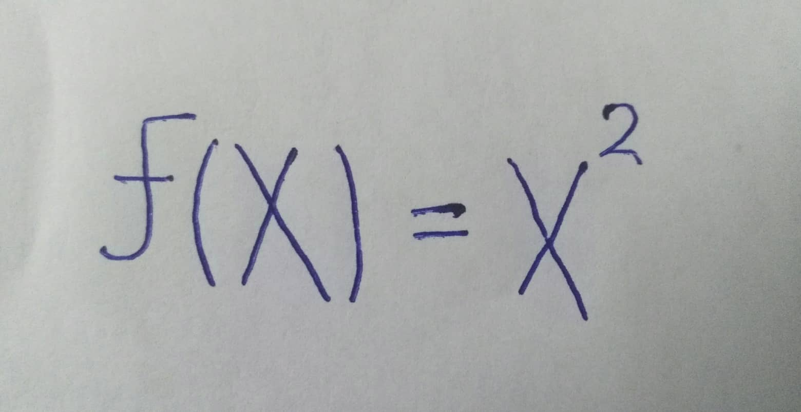
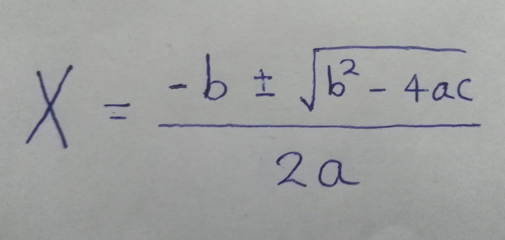

# Description

This project will make it easy to get the LaTeX syntax of some equation, by just writing the equation on a paper and photographing it. It might even give you a computer generated image of the equation or solve it if it could, who knows.

# Implementation

- Our entire stack will be built using [Python3](https://www.python.org/) as our programming language- for faster development.
- Web application built using [Flask](http://flask.pocoo.org/) or [Django](https://www.djangoproject.com/), we chose a web application so that our generator works across platforms. We might also build an android and desktop generator using [Kivy](https://kivy.org/) framework because of its cross-platform nature.
- Image preparation and processing will be done with the help of the famous [OpenCV](https://opencv.org/) library.
- Optical character recognition will be implemented using the famous [Tesseract](https://github.com/tesseract-ocr/tesseract) library.

# Timeline

| | Task | Estimated Time |
| --- | --- | --- |
| 1 | Image Processing, binarization.. etc | 3 days |
| 2 | OCR, understanding the equation | 2 Weeks |
| 3 | LaTeX syntax generator implementation | 4 days |
| 4 | Frontend and testing | 1 Week |


<!--| | Task 1 | Task 2 | Task 3 | Task 4 |-->
<!--| Member | Role | Role | Role | Role |-->
<!--| --- | --- | --- | --- | --- |-->
<!--| Ahmed |  |  |  |  |-->
<!--| Boula |  |  |  |  |-->
<!--| Eslam |  |  |  |  |-->
<!--| Menna |  |  |  |  |-->

If there is additional time we're going to implement another web frontend or make it recognize and generate multiple equations in the same image.
Of course, not all math syntax is going to be recognized in our initial version *-such as summations and integration-* but our implementation is going to modular by design to make it easy to add new features in the future.

# Samples

| Input Image | LaTeX code | Rendered Equation |
| --- | --- | --- |
|  | ```$f(x) = x^2$``` | $f(x) = x^2$ |
|
 | ```$g(x) = \frac{1}{x}$``` | $g(x) = \frac{1}{x}$ |
|  | ```$F(x) = \int^a_b \frac{1}{3} x^3$``` | $F(x) = \int^a_b \frac{1}{3} x^3$ |
|  | ```$x = \sum^{10}_{n=0} n$``` | $x = \sum^{10}_{n=0} n$ |
|  | ```$x = \frac{-b \pm \sqrt{b^2-4ac}}{2a}$``` | $x = \frac{-b \pm \sqrt{b^2-4ac}}{2a}$ |


<!--| | ```$H_c=\frac{1}{2n} \sum^n_{l=0} (-1)^{l}(n-{l})^{p-2} \sum_{l_1+\dots+l_p=l} \prod^p_{i=1} \binom{n_i}{l_i} \quad \cdot[(n-l)-(n_i-l_i)]^{n_i-l_i} \cdot[(n-l)^2-\sum^p_{j=1}(n_i-l _i)^2]$``` | $H_c=\frac{1}{2n} \sum^n_{l=0} (-1)^{l}(n-{l})^{p-2} \sum_{l_1+\dots+l_p=l} \prod^p_{i=1} \binom{n_i}{l_i} \quad \cdot[(n-l)-(n_i-l_i)]^{n_i-l_i} \cdot[(n-l)^2-\sum^p_{j=1}(n_i-l _i)^2]$ |-->

# References

[1] OpenCV [Documentation](http://opencv-python-tutroals.readthedocs.io/)
[2] [Setting up a Simple OCR Server](https://realpython.com/setting-up-a-simple-ocr-server/).
[3] LaTeX [Documentation](https://www.latex-project.org/help/documentation/amsldoc.pdf).
